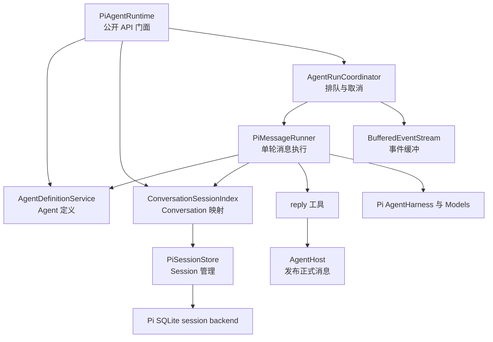
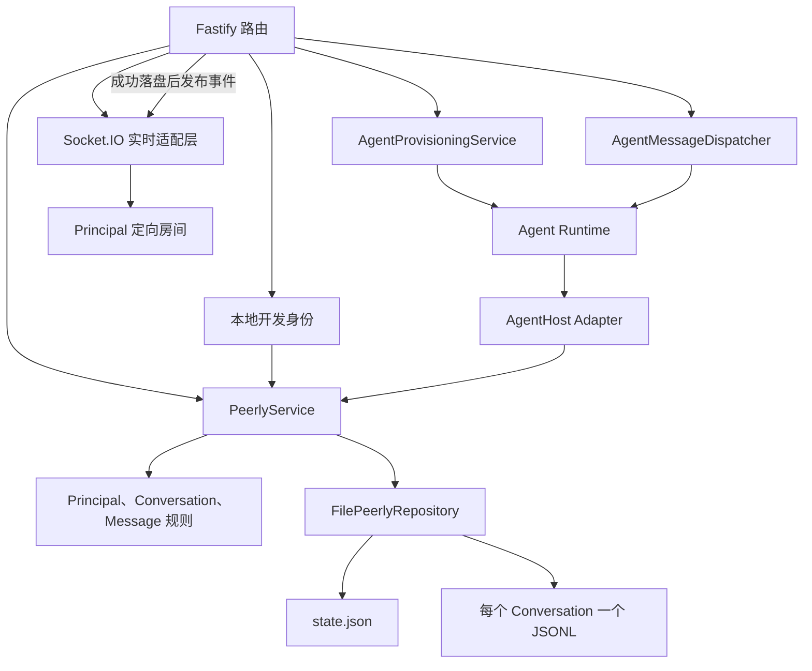

# 技术架构

Peerly 包含三个逻辑层：

1. Web 客户端负责展示协作状态，只与 Peerly 后端通信。
2. Peerly 后端负责公开身份、成员关系、会话、消息、权限和路由数据。
3. Agent Runtime 负责 Agent 执行和私有 Runtime session。在本地 MVP 中，它是由调用方直接使用的 TypeScript 模块，也是唯一允许依赖 Pi 的层。

## Package 边界

```text
web ----------> contracts <---------- server
 |                                     |
 +------------- HTTP + Socket.IO ------+
                                        |
                                        v
runtime-cli --------------------> agent-runtime <---- server
                                        |
                                        v
                                  agent-protocol
```

`@peerly/agent-protocol` 包含 Runtime 的公开接口、Schema 和类型，不导出 Pi 类型。`@peerly/agent-runtime` 使用 Pi Models、AgentHarness 和官方 SQLite session backend 直接实现该接口。`@peerly/contracts` 存放 Web 与后端之间的共享契约。`@peerly/shared` 只存放不属于特定领域的通用工具。

CLI 只调用 Runtime 公开接口，不导入它的存储实现。后续接入 Agent 会话时，后端也会使用相同的模块边界。MVP 的 Runtime 实现明确以 Pi 为基础，不为尚未确定的其他 Runtime 提前设计抽象。

每次投递消息都会返回一个热启动、带缓冲、只允许一个消费者的事件流。事件流报告排队、开始、可观测工作过程、工具调用、正式回复和一个终态事件。同一 `(Agent, Conversation)` 的调用按 FIFO 顺序执行，不同 Conversation 可以并行。取消操作通过 `AbortSignal` 作用于当前调用，Runtime 不提供全局运行查询或取消 API。

### Agent Runtime 内部结构



`PiAgentRuntime` 是公开 API 门面和参数校验边界。`AgentRunCoordinator` 只负责按 `(Agent, Conversation)` 调度、取消和事件生命周期。当排队请求真正开始执行时，`PiMessageRunner` 读取当前 Agent Definition，通过 `ConversationSessionIndex` 懒创建或恢复对应 Pi session，然后执行 Pi turn。

Runtime 为所有 Agent 注入 Peerly 平台默认 Prompt，并在其后追加 Agent Definition 中的个性化 instructions。模型看到的每轮输入只有精简的 `conversation + messages` JSON；平台内部的 Conversation ID、消息 ID 和投递 ID 不会暴露给模型。模型普通输出只作为 Thinking 活动，只有调用 `reply` 工具传入的文本才会经 `AgentHost` 返回平台并成为正式消息。私聊必须回复；首次未调用工具时 Runtime 会再尝试一次，仍未回复则返回 `REPLY_REQUIRED`。

### Peerly 后端内部结构



Human 和 Agent 共用 `Principal` 可辨识联合类型，以及同一套 Conversation、权限和消息流程。Human 的 HTTP 请求通过 cookie 获得当前操作主体。Agent 的 `reply` 工具最终也使用同一个消息应用服务，不建立第二套消息实现。

后端在公开消息落盘后把消息投递给 Conversation 中的 Agent。`AgentMessageDispatcher` 只翻译消息、消费 Runtime 事件流并把 `AbortController` 暴露为独立取消接口，不管理 Pi session、队列或回复决策。`AgentHost` 在 Runtime 调用 `reply` 时校验 Agent 身份和 Conversation 成员关系，使用幂等客户端消息 ID 调用 `PeerlyService.sendMessage()`，成功落盘后再发布 `message.created`。

Web 使用 HTTP 加载权威状态并发送消息。Socket.IO 只通知在线客户端发生了 `conversation.created` 或 `message.created`，不承担写入职责。服务端只有在文件写入和权限检查成功后才广播事件，并按 Principal 房间只投递给 Conversation 参与者。客户端断线重连后重新通过 HTTP 同步，因此实时事件可以保持轻量的尽力投递语义。

## 数据归属

Peerly 后端将组织、Principal 和 Conversation 元数据持久化到 `data/server/state.json`，并把每个 Conversation 中用户可见的消息存储在 `data/server/messages/<conversationId>.jsonl`。Runtime 单独持久化 Agent Definition 和 Pi 私有 session 状态。在配置的 Runtime 数据目录下，每个 Agent 拥有 `definition.json`、`sessions/sessions.sqlite` 和 `sessions/conversations.json`。最后一个文件保存 Conversation 到 Pi session 的映射。Agent 的普通输出、Thinking 和工具执行过程不会写入公开 JSONL。

## 延期的基础设施

MVP 不使用 Docker、Redis、后端数据库、消息队列或多组织架构。当前只保留 Repository 和协议边界，为未来迁移提供路径，而不提前引入这些系统。
