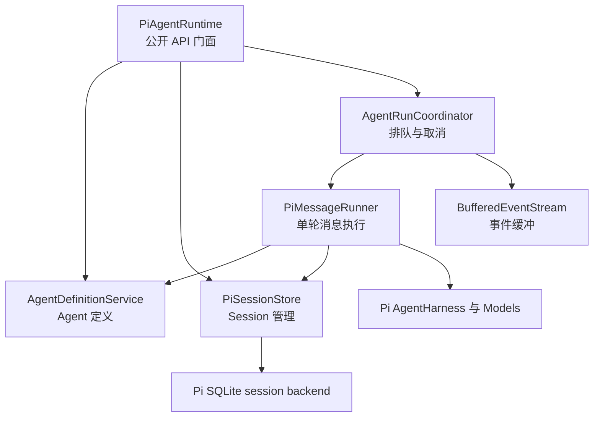
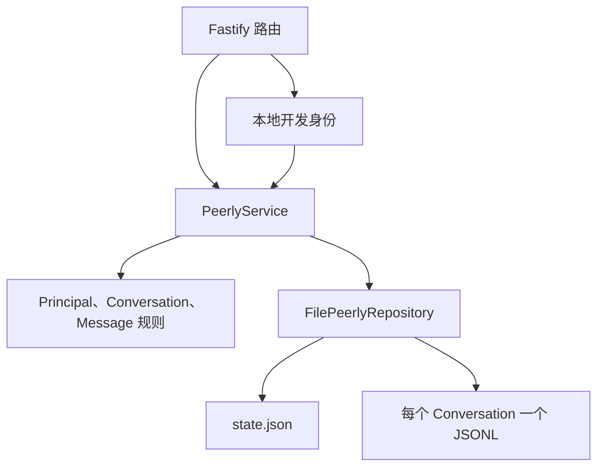

# 技术架构

Peerly 包含三个逻辑层：

1. Web 客户端负责展示协作状态，只与 Peerly 后端通信。
2. Peerly 后端负责公开身份、成员关系、会话、消息、权限和路由数据。
3. Agent Runtime 负责 Agent 执行和私有 Runtime session。在本地 MVP 中，它是由调用方直接使用的 TypeScript 模块，也是唯一允许依赖 Pi 的层。

## Package 边界

```text
web ----------> contracts <---------- server
                                        |
                                        v
runtime-cli --------------------> agent-runtime
                                        |
                                        v
                                  agent-protocol
```

`@peerly/agent-protocol` 包含 Runtime 的公开接口、Schema 和类型，不导出 Pi 类型。`@peerly/agent-runtime` 使用 Pi Models、AgentHarness 和官方 SQLite session backend 直接实现该接口。`@peerly/contracts` 存放 Web 与后端之间的共享契约。`@peerly/shared` 只存放不属于特定领域的通用工具。

CLI 只调用 Runtime 公开接口，不导入它的存储实现。后续接入 Agent 会话时，后端也会使用相同的模块边界。MVP 的 Runtime 实现明确以 Pi 为基础，不为尚未确定的其他 Runtime 提前设计抽象。

每次发送消息都会返回一个热启动、带缓冲、只允许一个消费者的事件流。事件流依次报告排队、开始、文本增量和一个终态事件。同一 Agent session 的调用按 FIFO 顺序执行，不同 session 可以并行。取消操作通过 `AbortSignal` 作用于当前调用，Runtime 不提供全局运行查询或取消 API。

### Agent Runtime 内部结构



`PiAgentRuntime` 是公开 API 门面和参数校验边界。`AgentRunCoordinator` 只负责按 session 调度、取消和事件生命周期。当排队请求真正开始执行时，`PiMessageRunner` 读取当前 Agent Definition，通过 `PiSessionStore` 打开 session，然后执行一个 Pi turn。这样既能在实际执行时生成配置快照，又不会让 Coordinator 依赖 Agent Definition 或存储细节。

### Peerly 后端内部结构



Human 和 Agent 共用 `Principal` 可辨识联合类型，以及同一套 Conversation、权限和消息流程。Human 的 HTTP 请求通过 cookie 获得当前操作主体。后续 Agent 编排模块会把 Agent 的 principal ID 传给同一个应用服务，而不是建立第二套消息实现。

## 数据归属

Peerly 后端将组织、Principal 和 Conversation 元数据持久化到 `data/server/state.json`，并把每个 Conversation 中用户可见的消息存储在 `data/server/messages/<conversationId>.jsonl`。Runtime 单独持久化 Agent Definition 和 Pi 私有 session 状态。在配置的 Runtime 数据目录下，每个 Agent 拥有一个 `agents/<agentId>/definition.json` 文件和一个 `agents/<agentId>/sessions/sessions.sqlite` 数据库。Runtime 输出只有经过后端校验并持久化后，才会成为公开消息。

## 延期的基础设施

MVP 不使用 Docker、Redis、后端数据库、消息队列或多组织架构。当前只保留 Repository 和协议边界，为未来迁移提供路径，而不提前引入这些系统。
