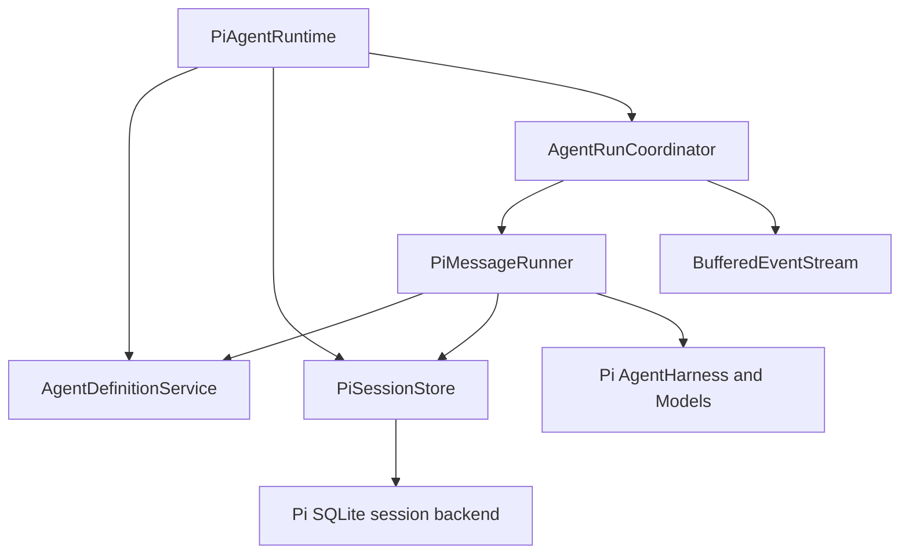

# Architecture

Peerly has three logical layers:

1. The web client renders collaboration state and communicates only with the Peerly server.
2. The Peerly server owns public identity, membership, conversation, message, authorization, and routing data.
3. The agent runtime owns agent execution and private runtime sessions. For the local MVP it is a TypeScript module called directly by its host, and it is the only layer allowed to depend on Pi.

## Package boundaries

```text
web ----------> contracts <---------- server
                                        |
                                        v
runtime-cli --------------------> agent-runtime
                                        |
                                        v
                                  agent-protocol
```

`@peerly/agent-protocol` contains the Runtime's public interface, schemas, and types. It does not export Pi types. `@peerly/agent-runtime` implements that interface directly with Pi Models, AgentHarness, and the official SQLite session backend. `@peerly/contracts` is reserved for browser/server contracts. `@peerly/shared` contains only utilities without domain ownership.

The server and CLI call the Runtime's public interface and do not import its storage internals. The implementation is intentionally Pi-specific for the MVP.

Each message call returns a hot, buffered, single-consumer event stream. It reports queued, started, text delta, and one terminal event. Calls for one Agent session execute FIFO, while independent sessions may execute concurrently. Cancellation is scoped to the call through an `AbortSignal`; the Runtime does not expose global run lookup or cancellation APIs.

### Agent Runtime internals



`PiAgentRuntime` is the public API facade and validation boundary. `AgentRunCoordinator` owns only per-session scheduling, cancellation, and event lifecycle. When a queued request starts, `PiMessageRunner` reads the current Agent definition, opens the session through `PiSessionStore`, and executes one Pi turn. This keeps configuration snapshots at execution time without coupling the coordinator to definition or storage details.

## Data ownership

The Peerly server will persist user-visible chat messages as JSON/JSONL. The runtime persists Agent definitions and private Pi session state separately. Each Agent owns an `agents/<agentId>/definition.json` file and an `agents/<agentId>/sessions/sessions.sqlite` database under the configured Runtime data directory. Runtime output becomes a public message only after the server validates and persists it.

## Deferred infrastructure

The MVP does not use Docker, Redis, a server database, a message broker, or multiple organizations. Repository and protocol boundaries preserve a migration path without introducing those systems now.
